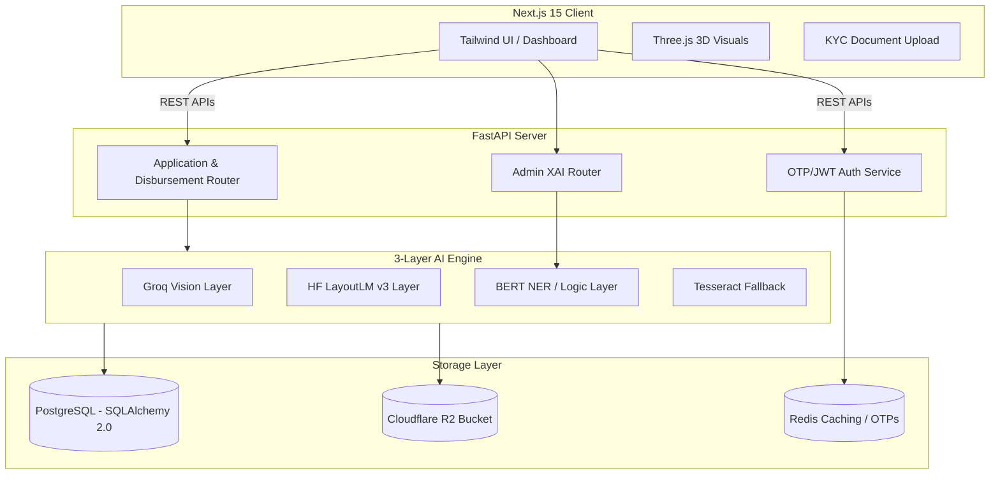

# NexLoan 🚀

NexLoan is a state-of-the-art, **AI-first personal loan origination platform** built for speed, compliance, and extreme transparency. It bridges the gap between complex document verification and seamless user experience, utilizing a multi-layered AI pipeline to automate traditionally manual financial processes.

---

## 🌟 Comprehensive Feature Set

### 🧠 Triple-Layer AI KYC Pipeline
Our document verification doesn't just "read" text; it understands it.
- **Layer 1: Groq Llama-3.2 Vision**: High-speed visual context extraction.
- **Layer 2: LayoutLM-DocVQA**: Document understanding via Hugging Face that "finds" fields based on visual layout (e.g., Aadhaar/PAN formats), solving the "garbage text" issues of standard OCR.
- **Layer 3: NLP Reconciliation**: BERT-based NER and fuzzy matching to detect identity fraud (mismatching names/IDs).
- **Fallback**: Local Tesseract OCR for data redundancy.

### 📑 Narrative-First Admin Dashboard & Workspace
We removed technical clutter. Admins no longer look at raw confidence scores; they read **"AI Auditor Narrative Reports"**—plain English explanations of system decisions (e.g., *"🚩 Identity Mismatch: Name on card is MAYUR, but applicant is SAHIL."*).

### 📐 Precision Underwriting Engine
Deterministic financial modeling including:
- **EMI Amortization**: Reducing balance lending calculations.
- **DTI Ratio**: Automated Debt-to-Income evaluation.
- **Risk-Based Pricing**: Dynamic interest rate matrices based on Credit Score bands.

### 🚦 Advanced Borrower Experience
- **Loan Readiness Score**: A 60-second pre-qualification tool without hard credit checks.
- **Application Tracking**: Real-time status tracking via a dynamic visual timeline.
- **Interactive Dashboard**: View EMI schedules, financial health metrics, and trigger "EMI Pauses" with automated restructuring.
- **Conversational AI Agent**: Persistent chat assistant that remembers past queries and context to guide borrowers.
- **Co-Applicant Workflow**: Invite a spouse or parent via SMS/Email to boost loan eligibility.

### 🔐 Access Control (RBAC)
Robust security separating Borrowers, Loan Officers, Admins, and Super Admins. Secure JWT-based session management integrated deeply into the frontend routes and backend dependencies.

### 💳 Payment Integration Notice
> **Note on Payment Gateways (Razorpay/Stripe):** 
> While the application architecture fully supports EMI repayments and dynamic schedule updates, the direct integration of a live Payment Gateway (like Razorpay) was omitted from this development phase. This is because acquiring functional sandbox credentials requires a registered business PAN/GST and verified KYC, which is outside the scope of this local development sandbox. All payment flows in the UI currently simulate a successful transaction to demonstrate the state updates (updating the EMI schedule, marking installments as PAID, etc.).

### 🛡️ Technical Excellence & Compliance
- **Auth**: Passwordless Email OTP powered by the **Brevo REST API** for 100% deliverability.
- **Security**: Redis-backed session management and TTL-based OTP security.
- **RBI Ready**: Immutable Audit Trails, Aadhaar masking (masking first 8 digits), and Cooling-off periods.

---

## 🏗️ System Architecture



---

## 🛠️ Technology Stack

- **Frontend**: Next.js 15+, React, TypeScript, Three.js (3D CreditCoin), Tailwind CSS.
- **Backend**: FastAPI, Python 3.12, SQLAlchemy 2.0 (Async).
- **Messaging**: Brevo REST API (Transactional Email).
- **AI/ML**: 
  - Hugging Face Inference API (`impira/layoutlm-document-qa`).
  - Groq Cloud API (Llama 3.2 Vision & Meta Llama 70B Text).
  - Pytesseract (Local OCR).
- **Infrastructure**: PostgreSQL, Redis, Cloudflare R2 (S3 compatibility).

---

## ⚙️ Development Setup

### Prerequisites
1. **Node.js** (v20+)
2. **Python** (v3.12+)
3. **PostgreSQL** & **Redis** (running locally or via Docker)
4. **Tesseract OCR** installed on system path.

### 1. Environment Configuration
Copy `.env.example` to `.env` in both the `frontend` and `backend` directories and fill in your API keys.

### 2. Backend Setup
```bash
cd backend
python -m venv venv
# Windows: venv\Scripts\activate | Mac/Linux: source venv/bin/activate
pip install -r requirements.txt

# Run Database Migrations
alembic upgrade head

# Start the Server
uvicorn app.main:app --reload
```

### 3. Frontend Setup
```bash
cd frontend
npm install

# Start the Server
npm run dev
```

### 4. Bypassing Auth for Development
During local development, you can bypass the email OTP verification. The backend accepts `123456` as a universal OTP for any email. Furthermore, the `frontend/app/layout.tsx` file contains an injected script that automatically populates a valid JWT into `localStorage`, granting immediate access to the dashboard and `LOAN_OFFICER` restricted routes.

---

## 🔒 Compliance & Security

NexLoan implements modern digital lending safeguards:
- **Auditability**: Every status change generates an immutable record in the `AuditLog` table.
- **Privacy**: Aadhaar numbers are masked ($XXXX-XXXX-1234$) before storage.
- **Reliability**: Fail-safe AI logic ensures that if high-confidence extraction fails, the application is routed for manual human verification.

---
*NexLoan — Powered by Theoremlabs*