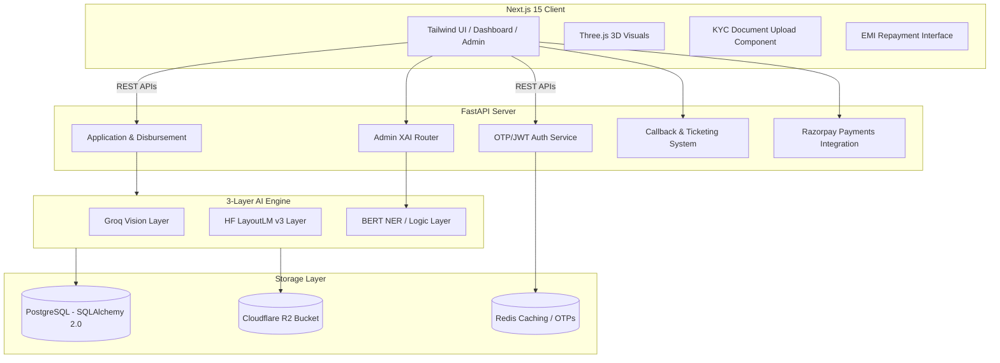

# NexLoan 🚀

NexLoan is a state-of-the-art, **AI-first personal loan origination and management product** built for speed, compliance, and an exceptional user experience. Moving beyond traditional "dumb" forms, NexLoan bridges the gap between complex document verification and seamless financial tracking by utilizing a multi-layered AI pipeline. This platform completely automates traditionally manual financial processes from origin to closure, reducing loan processing time from days to mere seconds.

---

## 🌟 Comprehensive Product Features & Innovations

### 🧠 Triple-Layer AI KYC Pipeline
Our document verification doesn't just "read" text; it truly understands the structural context and semantic layout of Indian compliance documents (Aadhaar & PAN cards).
1. **Layer 1: Groq Llama-3.2 Vision (High-Speed Extraction)**
   Utilizing Groq's LPU architecture, we process images of identity documents at blistering speeds. The vision model identifies key bounding boxes and extracts text, focusing on the visual positioning of the data.
2. **Layer 2: LayoutLM-DocVQA (Contextual Understanding)**
   Standard OCR often returns "garbage text" when reading complex IDs. We route documents through Hugging Face's LayoutLM framework which understands document structure. It "knows" that a 12-digit number near the bottom of an Aadhaar card is the ID, and that a 10-character alphanumeric string near the top of a PAN is the PAN number.
3. **Layer 3: NLP Reconciliation & Fraud Detection**
   We utilize BERT-based Named Entity Recognition (NER) and advanced fuzzy matching (Levenshtein distance algorithms) to cross-reference extracted names with the user's input data. This catches identity fraud (e.g., mismatching names) and assigns a dynamic AI Confidence Score.
4. **Fallback Engine: Local Tesseract OCR**
   In the event of API degradation, the system gracefully falls back to local PyTesseract OCR to ensure 100% uptime and data redundancy.

### 📐 Precision Underwriting & Risk Engine
We implemented deterministic financial modeling to ensure robust risk management and fair lending practices:
- **EMI Amortization**: We utilize standard reducing balance lending calculations to generate exact month-by-month repayment schedules down to the decimal.
- **Debt-to-Income (DTI) Ratio Evaluation**: The engine automatically cross-checks the user's declared monthly income against their existing EMIs and the proposed NexLoan EMI to ensure responsible borrowing.
- **Risk-Based Pricing**: Interest rates are not static. The system calculates dynamic interest rate matrices based on simulated Credit Score bands.

### 🚦 Advanced Borrower Experience & Smart UI
- **Interactive 3D Visuals**: Built with React Three Fiber, the landing page features interactive, physics-based 3D elements (such as the rotating NexLoan CreditCoin). This creates an incredibly premium, modern SaaS feel.
- **Loan Readiness Score**: A 60-second pre-qualification assessment tool that provides a risk score without impacting the user's actual CIBIL/Experian credit score.
- **Application Tracking**: A dynamic, React-based visual timeline allows borrowers to track their loan's real-time status (Inquiry -> KYC Pending -> Underwriting -> Approved -> Disbursed).
- **Smart Application Flow**: Intelligent form data capture featuring granular "Date of Birth" (Day/Month/Year split) and "Gender" tracking. These fields dynamically validate user input (e.g., ensuring applicants are 18+) and sync directly to the PostgreSQL backend.

### 🎧 Intelligent Support & Ticketing System
- **Context-Aware Callback Requests**: Users can request a callback directly from their dashboard. Instead of a generic ping, the modal requires the user to input a "Reason for Callback". This specific issue description is synced to the database and appears directly on the Support Officer's Admin Panel, ensuring they have full context before dialing the customer.
- **Interactive Support Tickets**: For complex issues, borrowers can raise persistent support tickets. The system provides a chat-like interface for asynchronous communication between users and Loan Officers, supporting status changes and resolution tracking.

### 💳 Complete EMI Repayment Management
- **Razorpay Integration (Simulation/Production Ready)**: A fully integrated payment flow for EMI processing. To allow seamless local development without requiring live business banking credentials, we built a robust Simulation Mode. 
- **Unique Order Simulation**: When a user clicks "Pay EMI", the backend generates a mathematically unique simulated Razorpay Order ID (preventing database `UniqueViolationError` conflicts). 
- **Automated State Tracking**: The moment an EMI is simulated as paid, the system triggers a cascade of events:
  - The specific EMI installment in the database is marked as `PAID` with a timestamp.
  - The `total_paid` metric on the overarching Loan record is incremented.
  - An immutable audit trail is written to the database.
  - The UI instantly re-hydrates to show the green "PAID" badge.

### 🎉 Dynamic Zero-Touch Loan Closure & Loyalty Rewards
- **Continuous Monitoring**: The payment engine acts as a state machine. Upon every successful EMI payment, it dynamically queries the database to check if `pending_emis == 0`.
- **Zero-Touch Closure**: If the final EMI is processed, the system requires zero human intervention. It instantly transitions the loan status from `ACTIVE` to `CLOSED`.
- **Celebratory Closure Experience**: Upon full repayment, the user is automatically redirected to a custom `/closure` route. This page features:
  - Animated Confetti to celebrate the financial milestone.
  - A visual "No-Dues Certificate" confirming the debt is settled, ready to be printed or downloaded as a PDF.
  - Journey Recap metrics: Total Repaid, Interest Saved, and Credit Score Improvement points.
- **Automated Pre-Approved Offers**: To drive customer retention, the closure page instantly calculates and presents a pre-approved offer for their next loan, complete with a discounted "Loyalty Rate", capitalizing on their pristine repayment history.

### 📑 Narrative-First Admin Dashboard & Workspace
- **Centralized Admin Hub**: A powerful Next.js interface for Loan Officers and Admins to manage the entire platform. This includes resolving support tickets, managing callback queues, and triggering manual underwriting overrides.
- **AI Auditor Narrative Reports**: Instead of forcing loan officers to decipher raw confidence scores or JSON outputs, the UI renders "Narrative Reports". The AI translates its findings into plain English explanations (e.g., *"🚩 Identity Mismatch: Name on card is MAYUR, but applicant is SAHIL."*).

### 🔐 Access Control, Security & Compliance
- **Role-Based Access Control (RBAC)**: Strict segregation between `BORROWER`, `LOAN_OFFICER`, and `ADMIN` roles. Secure JWT-based session management protects both frontend Next.js routes and backend FastAPI endpoints.
- **Passwordless Auth**: Frictionless email OTP login powered by the Brevo REST API, backed by Redis for rate-limiting and TTL expiration.
- **Data Privacy & Masking**: Aadhaar numbers are securely masked ($XXXX-XXXX-1234$) before being written to persistent storage to comply with RBI data privacy guidelines.
- **Immutable Auditability**: Every status change (from EMI payments to KYC approvals) generates a permanent record in the `AuditLog` table.

---

## 🏗️ Detailed System Architecture



---

## 🗄️ Database Schema Overview (PostgreSQL)
The application relies on a highly normalized relational database managed by SQLAlchemy 2.0 ORM and Alembic migrations.

- **`users`**: Stores user identities, roles, mobile numbers, and auth metadata.
- **`loans`**: The central entity tracking loan status, amounts, DTI ratios, interest rates, gender, Date of Birth, and closure timestamps.
- **`emi_schedule`**: Granular tracking of every single monthly installment, linking back to a specific loan.
- **`payments`**: Records of individual transaction attempts, Razorpay Order IDs, and payment signatures.
- **`kyc_documents`**: Stores references to S3/Cloudflare R2 objects along with the AI Confidence Score and verification verdicts.
- **`audit_logs`**: Immutable ledger of all system actions and state transitions.
- **`support_tickets` & `ticket_messages`**: Powers the conversational support system.
- **`callback_requests`**: Tracks users requesting phone support along with their specific "reason" text.

---

## 🛠️ Technology Stack Deep Dive

- **Frontend Ecosystem**: 
  - **Framework**: Next.js 15+ (App Router).
  - **UI/Styling**: React 18, Tailwind CSS, Lucide React (Icons).
  - **3D Graphics**: Three.js, React Three Fiber, React Three Drei.
  - **State Management**: React Hooks & LocalStorage for JWT session hydration.
- **Backend Ecosystem**: 
  - **Framework**: FastAPI (Asynchronous Python 3.12).
  - **ORM**: SQLAlchemy 2.0 (Asyncpg dialect).
  - **Migrations**: Alembic.
  - **Messaging**: Brevo REST API (Transactional Email).
- **AI/ML Infrastructure**: 
  - Hugging Face Inference API (`impira/layoutlm-document-qa`).
  - Groq Cloud API (Llama 3.2 Vision & Meta Llama 70B Text).
  - Pytesseract (Local fallback OCR).
- **Data & Storage Infrastructure**: 
  - **Database**: PostgreSQL.
  - **Caching**: Redis.
  - **Blob Storage**: Cloudflare R2 (S3 compatible API).

---

## ⚙️ Development Setup & Installation

### Prerequisites
1. **Node.js** (v20 or higher)
2. **Python** (v3.12 or higher)
3. **PostgreSQL** & **Redis** (running locally or via Docker containers)
4. **Tesseract OCR** (Must be installed on the system path to allow PyTesseract to function).

### 1. Environment Configuration
You must configure the environment variables before starting the servers. 
Copy `.env.example` to `.env` in **both** the `frontend` and `backend` directories. Fill in your PostgreSQL URI, Redis URI, Groq keys, Hugging Face tokens, and Brevo keys.

### 2. Backend Initialization
```bash
cd backend

# Create a virtual environment
python -m venv venv

# Activate the virtual environment
# Windows:
venv\Scripts\activate
# Mac/Linux:
source venv/bin/activate

# Install all Python dependencies
pip install -r requirements.txt

# Run Database Migrations to build the schema
alembic upgrade head

# Start the ASGI Server
uvicorn app.main:app --reload --port 8001
```

### 3. Frontend Initialization
```bash
cd frontend

# Install Node dependencies
npm install

# Start the Next.js Development Server
npm run dev
```

### 4. Bypassing Authentication for Local Development
To accelerate testing during local development, you can bypass the email OTP verification step:
- The backend automatically accepts `123456` as a universal "master" OTP for any email address.
- Furthermore, the `frontend/app/layout.tsx` file contains an injected script. If you uncomment or utilize it, it automatically populates a valid JWT payload directly into `localStorage`, granting immediate access to the dashboard and bypassing the login screen entirely.

---

## 📖 Detailed User Journey
1. **Landing & Discovery**: The user arrives at the visually stunning 3D landing page and clicks "Get Started".
2. **Passwordless Login**: The user inputs their email. A Brevo-powered OTP is dispatched. They enter the OTP to authenticate.
3. **Smart Application**: The user provides their required loan amount, tenure, explicit Date of Birth, Gender, and employment details. 
4. **AI KYC Upload**: The user uploads their Aadhaar and PAN cards. The Triple-Layer AI Pipeline scans the documents, extracts text via vision models, identifies layouts, and cross-references names to prevent fraud.
5. **Underwriting**: If the AI Confidence Score is high, the system automatically approves the loan, calculates the EMI schedule, and transitions the status. If the score is low, it halts and flags the application for a Loan Officer to review via the Admin Panel.
6. **Repayment & Tracking**: The user tracks their active loan on the Dashboard, viewing their exact EMI schedule. They can initiate Razorpay payments directly from the UI.
7. **Resolution & Closure**: Upon paying the final EMI, the user experiences the dynamic closure flow, receives their No-Dues Certificate, and is presented with a loyalty-based pre-approved offer for their next interaction with NexLoan.

---
*NexLoan — Built with AI, designed for humans.*